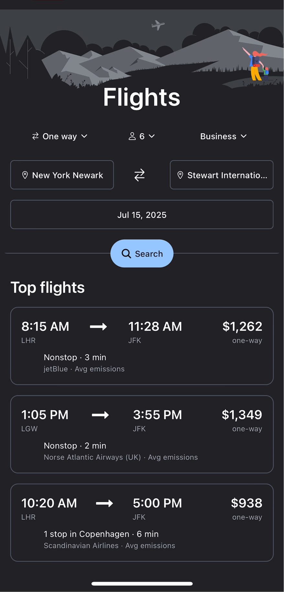
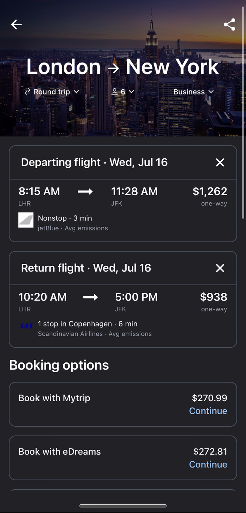
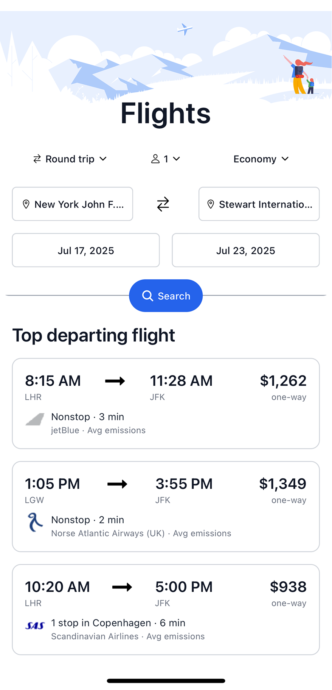

# Google Flights Clone ✈️

A sleek, fast mobile flight search app built with **Expo**, **React Native**, **TypeScript**, and **React Query**. Users can search for one-way or round-trip flights, view pricing options from multiple agents, and get detailed flight info — all with a modern UX.

---

## 🚀 Features

- 🔍 Flight search (one-way / round-trip)
- 📅 Departure and return date selection with calendar picker
- 🌐 Dynamic origin and destination airport input
- 💰 Agent comparison with pricing and ratings
- 📄 Flight details view with logo, duration, stops, and more
- 🌙 Dark mode friendly (Tailwind / NativeWind)
- 🧠 State managed via React Query

---

## 🧱 Tech Stack

- [Expo](https://expo.dev/)
- [React Native](https://reactnative.dev/)
- [TypeScript](https://www.typescriptlang.org/)
- [React Query (TanStack)](https://tanstack.com/query/latest)
- [NativeWind (Tailwind for RN)](https://www.nativewind.dev/)

---

## 📦 Setup Instructions

### 1. Clone the repo

```bash
git clone https://github.com/waweru-kamau/google-flights-app.git
cd google-flights-app
```

### 2. Install dependencies

```bash
npm install
```

### 3. Setup environment

Create a `.env` file (or configure your API base URL inside `lib/api.ts` and `lib/supabase.ts`):

```env
EXPO_PUBLIC_SUPABASE_URL=
EXPO_PUBLIC_SUPABASE_ANON_KEY=

EXPO_PUBLIC_RAPIDAPI_KEY=
EXPO_PUBLIC_RAPIDAPI_HOST=sky-scrapper.p.rapidapi.com
EXPO_PUBLIC_RAPIDAPI_URL=https://sky-scrapper.p.rapidapi.com/api

```

### 4. Run the app

```bash
npx expo run:ios
```

This launches the Expo dev tools and runs on iOS Simulator.

---

## 📸 Screenshots (Placeholder)

| Search Flights | Results View | Flight Details |
|----------------|--------------|----------------|
|  |  |  |

---

## 📄 License

MIT © Waweru Kamau

---

## 🙌 Acknowledgements

- Inspired by [Google Flights](https://www.google.com/travel/flights)
- Flights API: [SkyScraper on RapidAPI](https://rapidapi.com/apiheya/api/sky-scrapper)
